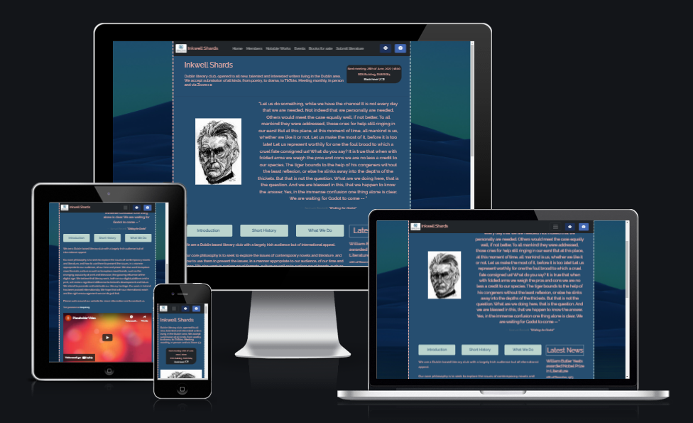

# **Inkwell Shards - Dublin Literature Club**
### Deployed: https://danmgocan.github.io/codeinstitute_proj1/

## Overview
The Inkwell Shards is a fictional Dublin literature club, whose purpose is to encourage and promote young and accomplished writers into creating valuable pieces of writing for the promotion of local and national culture and ideas. 
In order to promote its own work, attract new members and find valuable works of literature within the community, the Club created this website where it can present its work, its members, sell a few books and at the same time, make sure if offers a platform for any new writers to have where to send their submissions.

## Readme contents
1. [**Purpose, value, user stories**](#user-experience)
1. [**Target audience**](#target-audience)
1. [**External code used**](#external-code)
1. [**Features**](#features)
1. [**Deployment**](#deployment)
1. [**Performance**](#performance)
1. [**Known bugs**](#known-bugs)
1. [**Todo**](#todo)
1. [**Credits**](#credit)

## **User experience**
The purpose of this website is to bring together people passionate about writing under Inkwell Shards Dublin Literature Club. It should provide them with the opportunity to learn about each other, learn about the club opportunities and submit literature to be evaluated. 

#### A user should be able to:
* Find information about the club
* Contact the members of the club
* Find about events and opportunities
* Submit literature to the club for evaluation
* Apply for membership

## **Target audience**
The target audience is anyone living in Ireland, understanding English language and that has a network connected device that can access the Inkwell Shards website. The website can be accessed both from a mobile device and from a desktop computer or laptop. All information is provided in English. Literature can be uploaded both from a local file (.pdf for example) or pasted directly into the form provided. 

## **External code**
For this project Bootstrap 5 has been used extensively, especially:
* Grid system - all containers use Bootstrap 12 column system for responsivness and to divide the content on the screen.
* Navigation bar - the navigation bar is taken from the Bootstrap documentation and modified to fit the purpose. 
* Tables
* Bootstrap forms
* Snippets of code (html background in main.css) has been taken from https://css-tricks.com/ 

## **Features**
The main features of the website are:
### Navigation bar
* where the user can access all the pages of the website, together with the links to our Facebook community and our Mattermost server

### Home page
* where the user can find a representative text by Samuel Beckett
* where the user can find more details about our club, a placeholder video, a short history and more information about our role in the community. Please note that most text on this page has been generated by AI through a third party.
* where the user can find Latest News from the Irish Literar community

### Members page
* where the user can find a list with our most important members and means to contact them

### Notable works
* where the user can find the most well known pieces of literature created by members of our club

### Events
* where the user can find information about future literature related events and purchase tickets for them

### Books for sale
* where the user can find 8 books, their titles, authors and prices and can purchase them. Please note that as this was outside of the scope of this assignment, all "Add to cart" links lead nowhere and there is no back-end to support an online shop.

### Submit literature
* where users can either paste their literal work or upload a document of their choosing. 

## **Deployment**
The website has been deployed through GitHub pages and can be accessed at https://danmgocan.github.io/codeinstitute_proj1/index.html

## **Performance**

Lighthouse Report for Desktop:

Lighthouse Report for Mobile:

* It is noticed that a lot of Bootstrap JavaScript is masively slowing down the load of the site, together with the images used, which have **not** been optimized for web and their sizes are too large for the purpose
* Also to note that the performance low score is true only for the deployed version, the local one having a score of 100

## **Known bugs**
* None known at the moment 

## **Todo**
* properly comment the code as to make certain parts of the markup clearer
* write an extensive README.md document
* update the color scheme of the website

## **Credits**
All images used are copyright free and licenced under Creative Commons. All the attributions can be found [here](/credits.md)